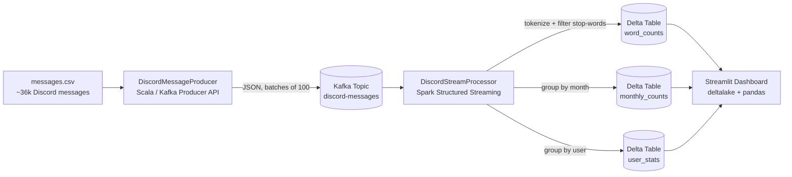

# Spark Streaming Discord Analytics

A real-time analytics pipeline built with **Apache Spark Structured Streaming**, **Apache Kafka**, **Delta Lake**, and **Streamlit**. The project ingests a stream of Discord messages, runs continuous aggregations on the live data, persists the results as ACID-compliant Delta tables, and serves them through an auto-refreshing dashboard.


---

## Overview

The pipeline simulates a live Discord server feed and demonstrates several advanced stream-processing patterns:

- **Event-time processing with watermarking** to handle late and out-of-order events
- **Stateful streaming aggregations** (word counts, monthly counts, per-user counts)
- **Multiple parallel streaming queries** sharing a single Kafka source
- **Idempotent upserts to Delta Lake** via `foreachBatch` + `MERGE INTO`
- **Stop-words filtering** for French text
- **Reference-data enrichment** (joining stream output with a members lookup table) at the dashboard layer

## Architecture



## Tech stack

| Layer            | Technology                                           |
|------------------|------------------------------------------------------|
| Language (JVM)   | Scala 2.12.18                                        |
| Stream processor | Apache Spark 3.5.1 (Structured Streaming)            |
| Message broker   | Apache Kafka 3.7 (KRaft mode, no ZooKeeper)          |
| Storage layer    | Delta Lake 3.2.0 on the local filesystem             |
| Build tool       | sbt 1.10                                             |
| Dashboard        | Streamlit + `deltalake` (Rust-backed) + pandas       |
| Configuration    | Typesafe Config (HOCON) with environment overrides   |
| Containers       | Docker Compose (Kafka + Kafka UI)                    |

## Project structure

```
spark-streaming-discord-analytics/
├── build.sbt                              # sbt build definition
├── project/
│   ├── build.properties                   # sbt version
│   └── plugins.sbt                        # sbt-assembly plugin
├── docker/
│   └── docker-compose.yml                 # Kafka + Kafka UI + topic init
├── data/
│   ├── messages.csv                       # source dataset (~36k rows)
│   └── members.csv                        # members lookup (UserID -> Nickname)
└── src/
    ├── main/
    │   ├── resources/
    │   │   ├── application.conf           # all tunable parameters
    │   │   ├── log4j2.xml                 # logging config
    │   │   └── stopwords-fr.txt           # 700+ French stop words
    │   └── scala/streaming/discord/
    │       ├── DiscordMessageProducer.scala    # CSV -> Kafka
    │       ├── DiscordStreamProcessor.scala    # Kafka -> Delta
    │       ├── config/AppConfig.scala          # HOCON loader
    │       └── model/DiscordMessage.scala      # case class + schema
    └── dashboard/
        ├── dashboard.py                   # Streamlit app
        └── requirements.txt               # Python dependencies
```

## Prerequisites

| Tool   | Version              | Why                                        |
|--------|----------------------|--------------------------------------------|
| JDK    | **17** (recommended) | Required by Spark 3.5                      |
| sbt    | 1.10+                | Builds the Scala project                   |
| Docker | recent + Compose     | Runs Kafka                                 |
| Python | 3.9+                 | Runs the dashboard                         |

> **JDK version matters.** Spark 3.5 requires JDK 11 or 17. JDK 8 and JDK 21 will crash at startup. JDK 17 is recommended.

### Installing the prerequisites

**JDK 17** — Download [Eclipse Temurin 17](https://adoptium.net/temurin/releases/?version=17) or install via your package manager:

```bash
# macOS (Homebrew)
brew install --cask temurin@17

# Windows (winget)
winget install EclipseAdoptium.Temurin.17.JDK

# Ubuntu / Debian
sudo apt install openjdk-17-jdk
```

**sbt** — Follow the [official sbt install guide](https://www.scala-sbt.org/download/) or:

```bash
# macOS
brew install sbt

# Windows
winget install sbt
```

> After installing JDK or sbt, **close and reopen your terminal** so the new PATH takes effect.

### Windows-specific setup: Hadoop utilities

Spark uses Hadoop libraries under the hood. On **macOS/Linux** this works out of the box. On **Windows**, Hadoop requires two extra files (`winutils.exe` and `hadoop.dll`) to interact with the local filesystem.

1. Create the folder `C:\hadoop\bin`
2. Download [`winutils.exe`](https://github.com/cdarlint/winutils/tree/master/hadoop-3.3.6/bin) and [`hadoop.dll`](https://github.com/cdarlint/winutils/tree/master/hadoop-3.3.6/bin) for Hadoop 3.3.x and place both files in `C:\hadoop\bin`
3. Set the environment variable **before** running sbt:

```powershell
# PowerShell — run these once per terminal session
$env:HADOOP_HOME = "C:\hadoop"
$env:PATH += ";C:\hadoop\bin"
```

Or set `HADOOP_HOME` permanently via *System Properties → Environment Variables* so you don't have to repeat this every time.

## Quick start

The pipeline has **four moving parts**: Kafka, the producer, the stream processor, and the Streamlit dashboard. You will need **four terminals**.

### 1. Start Kafka

```bash
cd docker
docker compose up -d
```

This boots a single-broker Kafka cluster in KRaft mode (no ZooKeeper), automatically creates the `discord-messages` topic, and starts the Kafka UI. Wait a few seconds, then verify:

- Kafka UI: [http://localhost:8080](http://localhost:8080) — you should see the `discord-messages` topic listed
- Broker: `localhost:9092`

### 2. Start the producer

In a new terminal at the project root:

```bash
sbt "runMain streaming.discord.DiscordMessageProducer"
```

The first run downloads all dependencies (this takes a few minutes). The producer then reads `data/messages.csv`, batches 100 records at a time, and publishes one batch per second as JSON to the Kafka topic. The full dataset takes about 6 minutes to publish.

### 3. Start the stream processor

In a new terminal at the project root:

```bash
sbt "runMain streaming.discord.DiscordStreamProcessor"
```

> **Windows note:** If sbt complains about a `ServerAlreadyBootingException` lock file, type `y` when prompted to create a new server. This happens when two sbt instances run in the same project.

Spark opens a long-lived streaming session, reads from the Kafka topic, and writes aggregated results to Delta tables under `data/output/`. You will see `WARN` messages like *"Current batch is falling behind"* — this is normal on a local machine and simply means each micro-batch takes slightly longer than the 5-second trigger interval.

### 4. Start the dashboard

In a new terminal:

```bash
cd src/dashboard
python -m venv .venv
source .venv/bin/activate       # Windows PowerShell: .\.venv\Scripts\Activate.ps1
pip install -r requirements.txt
streamlit run dashboard.py
```

> **Windows PowerShell note:** If `Activate.ps1` throws a red security error, run `Set-ExecutionPolicy -ExecutionPolicy RemoteSigned -Scope CurrentUser` once, then retry.

Open [http://localhost:8501](http://localhost:8501). The dashboard auto-refreshes every 5 seconds and shows:

- **Top 10 most-used words** (after stop-words filtering)
- **Top 3 most active users** (joined with `members.csv` to display nicknames)
- **Messages per month** for a selectable year

You should see the figures grow live as the producer feeds the topic.

## How it works

### Producer

`DiscordMessageProducer` reads the CSV row by row, validates each line has the expected 7 fields, serialises it to JSON via play-json, and sends it to Kafka with the `UserID` as the message key (so all messages from the same user land in the same partition). It batches 100 records, calls `flush()`, then sleeps 1 second to simulate a steady ingest rate.

### Stream processor

`DiscordStreamProcessor` opens one Kafka source and derives three independent streaming queries from it:

1. **Word counts** — explodes each message into words, normalises (lowercase, strip non-word characters), filters out empty tokens and French stop words, then `groupBy("word").count()`.
2. **Monthly counts** — derives `Month = yyyy-MM` from the event timestamp, then `groupBy("Month").count()`.
3. **User stats** — `groupBy("UserID").count()`.

A 10-minute event-time watermark is applied upstream, so very late events are dropped rather than blowing up state forever.

Each query writes to its own Delta table using `foreachBatch`. Because Spark's `update` output mode emits the **full running total** for every key that changed in a microbatch, the per-batch sink simply runs a `MERGE INTO ... WHEN MATCHED THEN UPDATE ALL WHEN NOT MATCHED THEN INSERT ALL`. This makes the pipeline fully **idempotent** — it is safe to restart from a checkpoint without any double-counting.

All three queries share the same lifecycle via `spark.streams.awaitAnyTermination()`, so a failure in any one query takes the whole job down (cleanly) rather than letting it run in a half-broken state.

### Dashboard

`dashboard.py` reads the Delta tables directly with the Rust-backed `deltalake` Python library — no JVM, no PySpark — and joins `user_stats` with `members.csv` in pandas to display human-readable nicknames.

## Configuration

All defaults live in `src/main/resources/application.conf` and can be overridden via environment variables:

| Variable                  | Default                  | Description                                |
|---------------------------|--------------------------|--------------------------------------------|
| `KAFKA_BOOTSTRAP_SERVERS` | `localhost:9092`         | Kafka broker address                       |
| `KAFKA_TOPIC`             | `discord-messages`       | Topic name                                 |
| `DATASET_PATH`            | `data/messages.csv`      | CSV file the producer reads                |
| `PRODUCER_BATCH_SIZE`     | `100`                    | Records per batch                          |
| `PRODUCER_BATCH_DELAY_MS` | `1000`                   | Pause between batches                      |
| `OUTPUT_BASE_PATH`        | `data/output`            | Root path for Delta tables and checkpoints |
| `STOPWORDS_PATH`          | `src/main/resources/stopwords-fr.txt` | Stop-words file path          |

Example (bash):

```bash
KAFKA_TOPIC=my-topic OUTPUT_BASE_PATH=/tmp/discord sbt "runMain streaming.discord.DiscordStreamProcessor"
```

Example (PowerShell):

```powershell
$env:KAFKA_TOPIC = "my-topic"
$env:OUTPUT_BASE_PATH = "C:\temp\discord"
sbt "runMain streaming.discord.DiscordStreamProcessor"
```

## Building a fat jar

For deployment outside of `sbt`:

```bash
sbt assembly
```

This produces `target/scala-2.12/spark-streaming-discord-analytics-1.0.0.jar`, which can be submitted to a Spark cluster:

```bash
spark-submit \
  --class streaming.discord.DiscordStreamProcessor \
  --packages io.delta:delta-spark_2.12:3.2.0,org.apache.spark:spark-sql-kafka-0-10_2.12:3.5.1 \
  target/scala-2.12/spark-streaming-discord-analytics-1.0.0.jar
```

## Stopping and resetting

**Stop everything:**

```bash
# Ctrl+C in each sbt / streamlit terminal, then:
cd docker
docker compose down
```

**Reset all state** — delete the output directory to wipe Delta tables and checkpoints:

```bash
rm -rf data/output                                        # macOS / Linux
Remove-Item -Recurse -Force data\output                   # Windows PowerShell
```

The next run of the stream processor will rebuild everything from the earliest Kafka offsets.

## Troubleshooting

**`Unrecognized option: --add-exports` at startup.** You are running JDK 8, which does not support module flags. Install JDK 17 (see Prerequisites). Verify with `java -version`.

**`HADOOP_HOME and hadoop.home.dir are unset` (Windows only).** Spark needs `winutils.exe` on Windows. Follow the *Windows-specific setup* section above to download the Hadoop utilities and set `HADOOP_HOME`.

**`UnknownTopicOrPartitionException: This server does not host this topic-partition`.** The Kafka topic does not exist yet. Make sure Docker Compose finished initialising (check `docker compose ps` — the `kafka-init` container should show `Exited (0)`). If the topic is still missing, create it manually:

```bash
docker exec discord-streaming-kafka /opt/kafka/bin/kafka-topics.sh \
  --create --if-not-exists --topic discord-messages \
  --bootstrap-server localhost:9092 --partitions 1 --replication-factor 1
```

**`Connection refused` from Spark or the producer.** Kafka is not up. Check `docker compose ps` and wait for the `kafka` container to be `healthy`.

**`ServerAlreadyBootingException` when running two sbt commands.** This happens on Windows when two sbt processes share the same project lock. Type `y` when prompted to create a new server instance.

**`UnsupportedOperationException: getSubject` or similar JDK errors.** You are on JDK 21, which Spark 3.5 does not officially support. Switch to JDK 17.

**`Cannot find data source: delta`.** sbt didn't pick up the Delta dependency. Run `sbt clean update` and try again.

**The dashboard says "No data yet" forever.** Both the producer *and* the stream processor must be running. Wait ~10 seconds for the first micro-batch to complete and write to Delta. If still empty, check the stream processor logs for errors.

**`Current batch is falling behind` warnings.** Normal on a local machine. Spark is processing data slower than the configured 5-second trigger interval. The pipeline still works correctly — batches simply queue up.

**PowerShell `Activate.ps1` security error.** Run `Set-ExecutionPolicy -ExecutionPolicy RemoteSigned -Scope CurrentUser` once to allow script execution.

## Dataset

`data/messages.csv` contains ~36,000 anonymised messages from a French Discord server, with seven columns: `Date, Channel, ServerID, ServerName, UserID, Message, Attachments`. `data/members.csv` is a small lookup table that maps user IDs to display nicknames.
