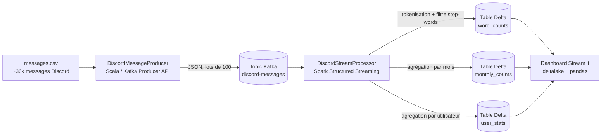

# Spark Streaming Discord Analytics

Pipeline d'analyse en temps réel construit avec **Apache Spark Structured Streaming**, **Apache Kafka**, **Delta Lake** et **Streamlit**. Le projet ingère un flux de messages Discord, exécute des agrégations continues sur les données en direct, persiste les résultats sous forme de tables Delta (ACID-compliant) et les affiche via un dashboard auto-rafraîchissant.


---

## Présentation

Le pipeline simule un flux de messages provenant d'un serveur Discord et met en œuvre plusieurs patterns avancés de traitement de flux :

- **Traitement par event-time avec watermarking** pour gérer les événements en retard ou désordonnés
- **Agrégations stateful en streaming** (comptage de mots, comptage mensuel, statistiques par utilisateur)
- **Trois requêtes de streaming parallèles** partageant une même source Kafka
- **Upserts idempotents vers Delta Lake** via `foreachBatch` + `MERGE INTO`
- **Filtrage des stop-words** pour du texte français
- **Enrichissement par données de référence** (jointure avec une table de membres) au niveau du dashboard

## Architecture



## Stack technique

| Couche             | Technologie                                          |
|--------------------|------------------------------------------------------|
| Langage (JVM)      | Scala 2.12.18                                        |
| Traitement de flux | Apache Spark 3.5.1 (Structured Streaming)            |
| Broker de messages | Apache Kafka 3.7 (mode KRaft, sans ZooKeeper)        |
| Couche de stockage | Delta Lake 3.2.0 sur le système de fichiers local    |
| Outil de build     | sbt 1.10                                             |
| Dashboard          | Streamlit + `deltalake` (Rust) + pandas              |
| Configuration      | Typesafe Config (HOCON) avec surcharge par variables d'environnement |
| Conteneurs         | Docker Compose (Kafka + Kafka UI)                    |

## Structure du projet

```
spark-streaming-discord-analytics/
├── build.sbt                              # Définition du build sbt
├── project/
│   ├── build.properties                   # Version de sbt
│   └── plugins.sbt                        # Plugin sbt-assembly
├── docker/
│   └── docker-compose.yml                 # Kafka + Kafka UI + création du topic
├── data/
│   ├── messages.csv                       # Dataset source (~36k lignes)
│   └── members.csv                        # Table de correspondance (UserID -> Pseudo)
└── src/
    ├── main/
    │   ├── resources/
    │   │   ├── application.conf           # Paramètres configurables
    │   │   ├── log4j2.xml                 # Configuration des logs
    │   │   └── stopwords-fr.txt           # 700+ stop-words français
    │   └── scala/streaming/discord/
    │       ├── DiscordMessageProducer.scala    # CSV -> Kafka
    │       ├── DiscordStreamProcessor.scala    # Kafka -> Delta
    │       ├── config/AppConfig.scala          # Chargement HOCON
    │       └── model/DiscordMessage.scala      # Case class + schéma
    └── dashboard/
        ├── dashboard.py                   # Application Streamlit
        └── requirements.txt               # Dépendances Python
```

## Prérequis

| Outil  | Version              | Rôle                                       |
|--------|----------------------|--------------------------------------------|
| JDK    | **17** (recommandé)  | Requis par Spark 3.5                       |
| sbt    | 1.10+                | Compilation du projet Scala                |
| Docker | récent + Compose     | Exécution de Kafka                         |
| Python | 3.9+                 | Exécution du dashboard                     |

> **La version de Java est critique.** Spark 3.5 nécessite JDK 11 ou 17. Les versions JDK 8 et JDK 21 provoquent un crash au démarrage. JDK 17 est recommandé.

### Installation des prérequis

**JDK 17** — Télécharger [Eclipse Temurin 17](https://adoptium.net/temurin/releases/?version=17) ou installer via un gestionnaire de paquets :

```bash
# macOS (Homebrew)
brew install --cask temurin@17

# Windows (winget)
winget install EclipseAdoptium.Temurin.17.JDK

# Ubuntu / Debian
sudo apt install openjdk-17-jdk
```

**sbt** — Suivre le [guide d'installation officiel](https://www.scala-sbt.org/download/) ou :

```bash
# macOS
brew install sbt

# Windows
winget install sbt
```

> Après installation de JDK ou sbt, **fermer et rouvrir le terminal** pour que le nouveau PATH soit pris en compte.

### Configuration spécifique à Windows : utilitaires Hadoop

Spark utilise les librairies Hadoop en arrière-plan. Sur **macOS/Linux**, cela fonctionne nativement. Sur **Windows**, Hadoop a besoin de deux exécutables supplémentaires (`winutils.exe` et `hadoop.dll`) pour interagir avec le système de fichiers local.

1. Créer le dossier `C:\hadoop\bin`
2. Télécharger [`winutils.exe`](https://github.com/cdarlint/winutils/tree/master/hadoop-3.3.6/bin) et [`hadoop.dll`](https://github.com/cdarlint/winutils/tree/master/hadoop-3.3.6/bin) pour Hadoop 3.3.x et placer les deux fichiers dans `C:\hadoop\bin`
3. Définir la variable d'environnement **avant** de lancer sbt :

```powershell
# PowerShell — exécuter une fois par session de terminal
$env:HADOOP_HOME = "C:\hadoop"
$env:PATH += ";C:\hadoop\bin"
```

Ou définir `HADOOP_HOME` de manière permanente via *Propriétés système → Variables d'environnement* pour ne pas avoir à répéter cette étape à chaque fois.

## Lancement rapide

Le pipeline comporte **quatre composants** : Kafka, le Producer, le Stream Processor et le dashboard Streamlit. Il faut **quatre terminaux**.

### 1. Démarrer Kafka

```bash
cd docker
docker compose up -d
```

Cette commande démarre un broker Kafka en mode KRaft (sans ZooKeeper), crée automatiquement le topic `discord-messages` et lance l'interface Kafka UI. Attendre quelques secondes, puis vérifier :

- Kafka UI : [http://localhost:8080](http://localhost:8080) — le topic `discord-messages` doit être listé
- Broker : `localhost:9092`

### 2. Démarrer le Producer

Dans un nouveau terminal, à la racine du projet :

```bash
sbt "runMain streaming.discord.DiscordMessageProducer"
```

Le premier lancement télécharge toutes les dépendances (cela prend quelques minutes). Le Producer lit ensuite `data/messages.csv`, constitue des lots de 100 enregistrements et publie un lot par seconde en JSON sur le topic Kafka. Le dataset complet prend environ 6 minutes à publier.

### 3. Démarrer le Stream Processor

Dans un nouveau terminal, à la racine du projet :

```bash
sbt "runMain streaming.discord.DiscordStreamProcessor"
```

> **Note Windows :** Si sbt affiche une erreur `ServerAlreadyBootingException` liée à un fichier de verrouillage, taper `y` quand il demande de créer un nouveau serveur. Cela arrive quand deux instances sbt tournent dans le même projet.

Spark ouvre une session de streaming longue durée, lit les messages depuis le topic Kafka et écrit les résultats agrégés dans des tables Delta sous `data/output/`. Des messages `WARN` du type *"Current batch is falling behind"* apparaîtront — c'est normal en local, cela signifie simplement que chaque micro-batch prend un peu plus que les 5 secondes de l'intervalle de déclenchement.

### 4. Démarrer le dashboard

Dans un nouveau terminal :

```bash
cd src/dashboard
python -m venv .venv
source .venv/bin/activate       # Windows PowerShell : .\.venv\Scripts\Activate.ps1
pip install -r requirements.txt
streamlit run dashboard.py
```

> **Note Windows (PowerShell) :** Si `Activate.ps1` provoque une erreur de sécurité (en rouge), exécuter `Set-ExecutionPolicy -ExecutionPolicy RemoteSigned -Scope CurrentUser` une fois, puis réessayer.

Ouvrir [http://localhost:8501](http://localhost:8501). Le dashboard se rafraîchit automatiquement toutes les 5 secondes et affiche :

- **Top 10 des mots les plus utilisés** (après filtrage des stop-words)
- **Top 3 des utilisateurs les plus actifs** (jointure avec `members.csv` pour afficher les pseudos)
- **Nombre de messages par mois** pour une année sélectionnable

Les chiffres évoluent en direct au fur et à mesure que le Producer alimente le topic.

## Fonctionnement détaillé

### Producer

`DiscordMessageProducer` lit le CSV ligne par ligne, valide que chaque ligne contient bien les 7 champs attendus, sérialise le tout en JSON via play-json, et envoie les messages à Kafka en utilisant le `UserID` comme clé de message (garantissant que tous les messages d'un même utilisateur arrivent sur la même partition). Il constitue des lots de 100 enregistrements, appelle `flush()`, puis attend 1 seconde pour simuler un flux d'ingestion régulier.

### Stream Processor

`DiscordStreamProcessor` ouvre une source Kafka unique et en dérive trois requêtes de streaming indépendantes :

1. **Comptage de mots** — découpe chaque message en mots, normalise (minuscules, suppression des caractères non-alphanumériques), filtre les tokens vides et les stop-words français, puis `groupBy("word").count()`.
2. **Comptage mensuel** — dérive `Month = yyyy-MM` à partir du timestamp de l'événement, puis `groupBy("Month").count()`.
3. **Statistiques par utilisateur** — `groupBy("UserID").count()`.

Un watermark event-time de 10 minutes est appliqué en amont, de sorte que les événements très en retard sont éliminés plutôt que de faire exploser l'état en mémoire.

Chaque requête écrit dans sa propre table Delta via `foreachBatch`. Comme le mode de sortie `update` de Spark émet le **total cumulé complet** pour chaque clé modifiée dans un micro-batch, le sink exécute simplement un `MERGE INTO ... WHEN MATCHED THEN UPDATE ALL WHEN NOT MATCHED THEN INSERT ALL`. Cela rend le pipeline totalement **idempotent** — il est possible de le redémarrer depuis un checkpoint sans risque de double comptage.

Les trois requêtes partagent le même cycle de vie via `spark.streams.awaitAnyTermination()`, de sorte qu'une défaillance de l'une d'entre elles arrête proprement l'ensemble du job plutôt que de le laisser tourner dans un état dégradé.

### Dashboard

`dashboard.py` lit les tables Delta directement avec la librairie Python `deltalake` (basée sur Rust) — sans JVM, sans PySpark — et effectue une jointure entre `user_stats` et `members.csv` en pandas pour afficher les pseudos lisibles.

## Configuration

Tous les paramètres par défaut se trouvent dans `src/main/resources/application.conf` et sont surchargeables via des variables d'environnement :

| Variable                  | Défaut                   | Description                                |
|---------------------------|--------------------------|--------------------------------------------|
| `KAFKA_BOOTSTRAP_SERVERS` | `localhost:9092`         | Adresse du broker Kafka                    |
| `KAFKA_TOPIC`             | `discord-messages`       | Nom du topic                               |
| `DATASET_PATH`            | `data/messages.csv`      | Fichier CSV lu par le Producer             |
| `PRODUCER_BATCH_SIZE`     | `100`                    | Nombre d'enregistrements par lot           |
| `PRODUCER_BATCH_DELAY_MS` | `1000`                   | Pause entre les lots (ms)                  |
| `OUTPUT_BASE_PATH`        | `data/output`            | Chemin racine des tables Delta et checkpoints |
| `STOPWORDS_PATH`          | `src/main/resources/stopwords-fr.txt` | Chemin du fichier de stop-words |

Exemple (bash) :

```bash
KAFKA_TOPIC=mon-topic OUTPUT_BASE_PATH=/tmp/discord sbt "runMain streaming.discord.DiscordStreamProcessor"
```

Exemple (PowerShell) :

```powershell
$env:KAFKA_TOPIC = "mon-topic"
$env:OUTPUT_BASE_PATH = "C:\temp\discord"
sbt "runMain streaming.discord.DiscordStreamProcessor"
```

## Construction du fat jar

Pour un déploiement sans `sbt` :

```bash
sbt assembly
```

Cela produit `target/scala-2.12/spark-streaming-discord-analytics-1.0.0.jar`, qui peut être soumis à un cluster Spark :

```bash
spark-submit \
  --class streaming.discord.DiscordStreamProcessor \
  --packages io.delta:delta-spark_2.12:3.2.0,org.apache.spark:spark-sql-kafka-0-10_2.12:3.5.1 \
  target/scala-2.12/spark-streaming-discord-analytics-1.0.0.jar
```

## Arrêt et réinitialisation

**Tout arrêter :**

```bash
# Ctrl+C dans chaque terminal sbt / streamlit, puis :
cd docker
docker compose down
```

**Réinitialiser l'état** — supprimer le dossier output pour effacer les tables Delta et les checkpoints :

```bash
rm -rf data/output                                        # macOS / Linux
Remove-Item -Recurse -Force data\output                   # Windows PowerShell
```

Au prochain lancement, le Stream Processor reconstruira tout depuis les premiers offsets Kafka.

## Résolution de problèmes

**`Unrecognized option: --add-exports` au démarrage.** JDK 8 est installé et ne supporte pas les flags de modules. Installer JDK 17 (voir la section Prérequis). Vérifier avec `java -version`.

**`HADOOP_HOME and hadoop.home.dir are unset` (Windows uniquement).** Spark nécessite `winutils.exe` sous Windows. Suivre la section *Configuration spécifique à Windows* ci-dessus pour télécharger les utilitaires Hadoop et définir `HADOOP_HOME`.

**`UnknownTopicOrPartitionException: This server does not host this topic-partition`.** Le topic Kafka n'existe pas encore. Vérifier que Docker Compose a fini son initialisation (`docker compose ps` — le conteneur `kafka-init` doit afficher `Exited (0)`). Si le topic est toujours absent, le créer manuellement :

```bash
docker exec discord-streaming-kafka /opt/kafka/bin/kafka-topics.sh \
  --create --if-not-exists --topic discord-messages \
  --bootstrap-server localhost:9092 --partitions 1 --replication-factor 1
```

**`Connection refused` depuis Spark ou le Producer.** Kafka n'est pas démarré. Vérifier `docker compose ps` et attendre que le conteneur `kafka` soit au statut `healthy`.

**`ServerAlreadyBootingException` en lançant deux commandes sbt.** Cela arrive sous Windows quand deux processus sbt partagent le même fichier de verrouillage. Taper `y` quand sbt propose de créer une nouvelle instance.

**`UnsupportedOperationException: getSubject` ou erreurs JDK similaires.** JDK 21 est installé, or Spark 3.5 ne le supporte pas officiellement. Passer à JDK 17.

**`Cannot find data source: delta`.** sbt n'a pas récupéré la dépendance Delta Lake. Lancer `sbt clean update` et réessayer.

**Le dashboard affiche "No data yet" indéfiniment.** Le Producer **et** le Stream Processor doivent tous deux être en cours d'exécution. Attendre ~10 secondes pour que le premier micro-batch soit complété et écrit dans Delta. Si toujours vide, vérifier les logs du Stream Processor.

**Messages `Current batch is falling behind`.** Normal en local. Spark traite les données plus lentement que l'intervalle de déclenchement de 5 secondes. Le pipeline fonctionne quand même correctement — les batchs s'accumulent simplement.

**Erreur de sécurité `Activate.ps1` sous PowerShell.** Exécuter `Set-ExecutionPolicy -ExecutionPolicy RemoteSigned -Scope CurrentUser` une fois pour autoriser l'exécution des scripts.

## Dataset

`data/messages.csv` contient environ 36 000 messages anonymisés provenant d'un serveur Discord français, avec sept colonnes : `Date, Channel, ServerID, ServerName, UserID, Message, Attachments`. `data/members.csv` est une petite table de correspondance qui associe les identifiants d'utilisateurs à leurs pseudos.
